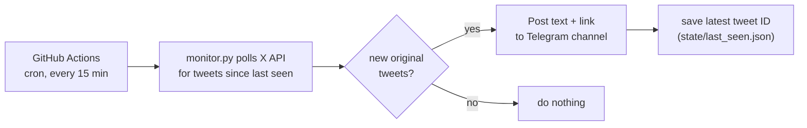

# X → Telegram Autoshare

**Automatically post your new X (Twitter) tweets to a Telegram channel.** Runs on free GitHub Actions every 15 minutes. No server, no laptop required, no third-party service holding your keys.

You bring your own keys (X API + Telegram bot). An AI agent does the rest of the setup for you.

---

> [!IMPORTANT]
> **This is a "from now on" mirror, not a backfill.**
> The first run records your latest tweet ID and sends **nothing**. Only tweets you post **after** setup get mirrored. Your existing tweet history is never pushed.
>
> It also mirrors **original tweets only** — replies, retweets, and quote-tweets are skipped by default.

---

## Fastest setup: let an agent do it

Clone this repo, open it with your AI coding agent, and paste the prompt. The agent creates a new repo for your mirror, scaffolds the files, and walks you through every key step by step.

```bash
git clone https://github.com/fraserbrownirl/T.git
cd T
```

Then pick your tool:

<details open>
<summary><b>Cursor</b></summary>

1. Open the `T` folder in Cursor.
2. Open the chat panel (`Cmd/Ctrl + L`).
3. Paste this:

```
Use the x-to-telegram-mirror skill (skills/x-to-telegram-mirror/SKILL.md) to set up
automatic X → Telegram mirroring for me. Create a new GitHub repo for the mirror,
scaffold the templates into it, then walk me step by step through getting my X API
bearer token, my Telegram bot token, and my channel ID, and setting the four GitHub
secrets. Ask me for each value when you need it.
```
</details>

<details>
<summary><b>Claude Code</b></summary>

1. From inside the cloned `T` folder, run:

```bash
claude
```

2. Paste this:

```
Read skills/x-to-telegram-mirror/SKILL.md and set up automatic X → Telegram mirroring
for me. Create a new GitHub repo for the mirror, scaffold the templates into it, then
walk me step by step through getting my X API bearer token, my Telegram bot token, and
my channel ID, and setting the four GitHub secrets. Ask me for each value when you need it.
```
</details>

<details>
<summary><b>Codex CLI / other agents</b></summary>

From inside the cloned `T` folder, start your agent and paste:

```
Read skills/x-to-telegram-mirror/SKILL.md in this repo and follow it to set up
automatic X → Telegram mirroring for me. Create a new GitHub repo for the mirror,
scaffold the templates into it, then walk me step by step through getting my X API
bearer token, my Telegram bot token, and my channel ID, and setting the four GitHub
secrets. Ask me for each value when you need it.
```
</details>

The agent reads [`SKILL.md`](SKILL.md), which contains the full phase-by-phase instructions.

> [!TIP]
> Setup pushes a GitHub Actions workflow file, which needs the **`workflow`** token scope. If your agent uses the `gh` CLI and the push gets rejected, run this once and retry:
> ```bash
> gh auth refresh -h github.com -s workflow
> ```
> The skill instructs the agent to handle this automatically, but this is the fix if you see a `without workflow scope` error.

---

## What you need (4 things)

The agent will ask for these one at a time. You can grab them ahead of time if you like.

| # | Secret | Where to get it | Notes |
|---|--------|-----------------|-------|
| 1 | **X API Bearer token** | [developer.x.com](https://developer.x.com) → Project → App → Keys and tokens | Paid, pay-per-use. **~$0.50–3/month** for one account. Set a spending limit. |
| 2 | **Your X username** | Your profile handle, **without** the `@` | e.g. `naval` |
| 3 | **Telegram bot token** | [@BotFather](https://t.me/BotFather) → `/newbot` | Free. |
| 4 | **Telegram channel ID** | Create a channel, add your bot as **admin**, then read it from `getUpdates` (the agent shows you how) | Usually starts with `-100…` |

> [!NOTE]
> These keys are added as **GitHub Actions secrets on *your* mirror repo** — never committed to git, never stored in this open-source repo, never sent to anyone else.

---

## How it works



- **Latency:** up to ~15 minutes after you post.
- **Runs in the cloud:** your laptop can be off.
- **Cost:** GitHub Actions is free for this; the only cost is your X API usage (~$0.50–3/mo).

Full behavior, costs, and a troubleshooting table: [reference.md](reference.md).

---

## Manual setup (no agent)

Prefer to do it yourself? The templates in [`templates/`](templates/) are everything you need.

1. Create a **new GitHub repo** (private is fine).
2. Copy these into it:
   - [`templates/monitor.py`](templates/monitor.py) → `monitor.py`
   - [`templates/requirements.txt`](templates/requirements.txt) → `requirements.txt`
   - [`templates/gitignore`](templates/gitignore) → `.gitignore`
   - [`templates/mirror.yml`](templates/mirror.yml) → `.github/workflows/mirror.yml`
   - [`templates/state/.gitkeep`](templates/state/) → `state/.gitkeep`
3. Push to your repo.
4. Add the four secrets: **Settings → Secrets and variables → Actions** (`TWITTER_BEARER_TOKEN`, `TWITTER_USERNAME`, `TELEGRAM_BOT_TOKEN`, `TELEGRAM_CHAT_ID`).
5. **Actions → X to Telegram Mirror → Run workflow** once to seed state. Then it runs itself.

---

## FAQ

**Will it post my old tweets?** No. It's a from-now-on mirror (see the note at the top).

**Why not instant?** GitHub Actions cron runs on a schedule. Real-time X streaming requires a paid legacy tier. Want faster? Lower the `cron` interval in `mirror.yml` (slightly higher API cost).

**Can I mirror someone else's account?** Yes — set `TWITTER_USERNAME` to any public handle.

**Can I include replies/retweets?** Yes — adjust the `exclude` filter in `monitor.py`.

---

## For agents

The authoritative instructions are in [SKILL.md](SKILL.md). Templates are in [templates/](templates/). Reference and troubleshooting in [reference.md](reference.md).

Template source: [cosineai-x-telegram-notifier](https://github.com/EleftheriaBatsou/cosineai-x-telegram-notifier), extended with per-tweet state persistence.
