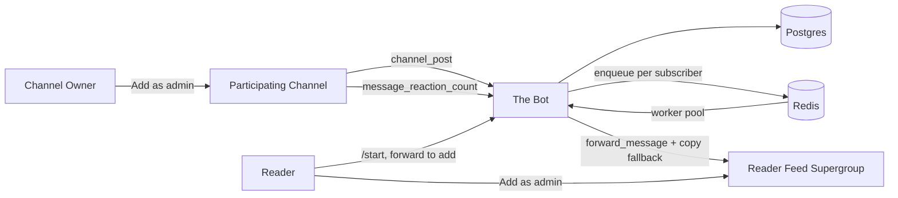

# AGENTS.md - Telegram Personal Feed

Guide for AI agents working in this repo. Read this before changes.

## What this is

A multi-user Telegram feed aggregator built on the **Bot API**. One bot plays two roles:

| Role | Surface | What it does |
|------|---------|--------------|
| Source-side | Admin in a participating channel (read-only) | Receives `channel_post` and `message_reaction_count` updates |
| Reader-side | Admin in a reader's forum supergroup | Creates `Newest` / `Popular` / `For You` topics, forwards relevant posts in |

A reader can subscribe to a source channel only if **both** are true:
1. The channel owner added our bot as an admin (channel is *participating*).
2. The reader is a member of the channel (verified via `getChatMember`).

**No MTProto, no user sessions, no api_id.** The previous Pyrogram + user-session design was removed in favor of pure Bot API.

## Quick start

```bash
cp .env.example .env     # set TELEGRAM_BOT_TOKEN and TELEGRAM_BOT_USERNAME
docker compose up --build
```

Then in Telegram:
- A reader opens the bot, sends `/start`, follows the instructions to create a forum supergroup and add the bot as admin with Manage Topics permission. The bot auto-creates the three topics.
- A channel owner opens their channel settings and adds the bot as administrator with zero permissions ticked. Their channel joins the directory.
- Reader forwards any post from a participating channel into the bot's DM. Bot verifies subscription and adds the channel to the reader's feed.

## Repository map

```
bot/
  main.py          entry point: dispatcher, allowed_updates, default admin rights, polling
  onboarding.py    /start, supergroup detection, topic creation
  source_admin.py  channel admin events, channel_post, message_reaction_count
  subscriptions.py forward-to-add, deep links, /list, /pause, /resume, callbacks, getChatMember
  fanout.py        Redis queue + worker pool: forward/copy with attribution, album buffering, rate cap
  popular.py       Popular digest: score by reactions x recency x channel-normalization
  foryou.py        For You digest: co-subscription + trending recommendations
  scheduler.py     asyncio periodic loops: popular, foryou, membership reverify
  copy.py          user-facing strings in one place
db/
  models.py        User, ParticipatingChannel, Subscription, ChannelPost, PostReaction, DigestRun
  session.py       async engine + session factory
alembic/           single revision 001 with the full schema
config.py          pydantic-settings env loader
PRIVACY.md          user-facing privacy policy (host it + register URL in BotFather)
docker-compose.yml postgres, redis, migrate, bot
Dockerfile         python:3.12-slim + requirements.txt
```

## Data flow



## Critical design rules

- **Bot API only.** Never reintroduce Pyrogram / MTProto / api_id.
- **Two trust gates** for any (channel, user) mirror: channel admin opt-in AND `getChatMember` says reader is in `{creator, administrator, member}`.
- **One bot, two roles.** Do not create a separate "source bot" or "worker bot"; permissions and update routing are handled by chat type filters.
- **Forum supergroup for reader feed.** Topics require `is_forum=True`. We don't create the supergroup (Bot API can't); the reader does it via the Telegram UI.
- **Posts are global, not per-user.** `channel_posts` rows are unique on `(channel_id, message_id)`. Fanout happens at delivery time, not at storage time.
- **Forward only; skip protected sources.** `is_forward_restricted` in `bot/fanout.py` catches Bot API "can't forward" errors. We deliberately do **not** fall back to `copy_message`: a channel that enables `protect_content` has signalled its posts must not leave the channel, and copying them out is hard to square with Bot Developer Terms 5.2 and the Content Licensing Terms (non-transferable license). Protected posts are skipped in both Newest fanout and the Popular digest. Popular uses `forward_message` (not `copy_message`) for the same reason.
- **Data minimization + retention.** Store only what the feed needs. `bot/scheduler.py` runs a `retention_purge` loop that deletes `channel_posts` (cascading to `post_reactions`) older than `post_retention_hours` (default 72h, must exceed the longest digest window) and `digest_runs` older than `digest_run_retention_days`. This satisfies Bot Developer Terms 4.2/4.3.
- **Privacy policy is mandatory.** Bot Developer Terms 4 requires an accessible privacy policy. See `PRIVACY.md`; host it and register the URL in `@BotFather` and via `PRIVACY_POLICY_URL`. The `/privacy` command serves the URL (or a built-in summary if unset).
- **Album debouncing.** Bot API delivers each media-group item as a separate `channel_post`. Buffer for `album_buffer_seconds`, then enqueue as a single batch -> `bot.forward_messages` (plural).
- **`allowed_updates` is explicit.** `message_reaction_count`, `my_chat_member`, and `chat_member` are not in the Bot API default. See `bot/main.py:ALLOWED_UPDATES`.

## Database

| Table | Purpose |
|-------|---------|
| `users` | telegram_id, setup_state, feed_supergroup_id, topic_*_id |
| `participating_channels` | chat_id, title, username, status (active/revoked), owner_user_id |
| `subscriptions` | user <-> channel, paused flag |
| `channel_posts` | one row per source post, dedup on `(channel_id, message_id)` |
| `post_reactions` | total_count per post, refreshed from `message_reaction_count` |
| `digest_runs` | bookkeeping for Popular and For You runs |

Migrations: `alembic upgrade head`. The schema is dev-only; if it changes, drop and rebuild rather than maintain compatibility migrations during this prototype phase.

## Pitfalls checklist

| Pitfall | Why it breaks |
|---------|----------------|
| Reintroducing MTProto for "auto-import follows" | Brings back api_id flagging; users hate it |
| Forwarding without membership check | Becomes a megaphone, owner-consent story collapses |
| Trying to create the user's supergroup from the bot | Bot API can't; only users can create groups |
| Skipping `allowed_updates` for reactions / chat_member | Popular signal goes dead, owner opt-in undetectable |
| Posting Newest directly from the channel_post handler | Blocks the update queue; fanout has to be async via Redis |
| Re-adding a `copy_message` fallback for protected channels | Overrides the owner's `protect_content` choice; ToS risk (5.2 / Content Licensing). Skip protected posts instead |
| Setting `post_retention_hours` below the digest window | Purge would starve Popular/For You; keep it comfortably above `popular_window_hours` |
| Shipping without a registered privacy policy | Violates Bot Developer Terms 4; multi-user bot stores others' post references |

## Operating commands (reader DM)

- `/start` - onboarding or status
- `/list` - subscribed channels with Pause/Remove buttons
- `/pause` / `/resume` - global mute
- `/privacy` - privacy policy URL or built-in summary
- `/start add_<channel_pk>` - deep link used by For You cards

## What is not built

- Mini App / web UI - parked.
- Channel-owner analytics dashboard - parked.
- Topical similarity in For You (embeddings) - parked.
- Multi-bot scale-out / sharding - parked, single bot is fine for prototype.

## X → Telegram mirror (agent skill, separate product)

This repo also ships **`skills/x-to-telegram-mirror/`** — an agent skill that scaffolds a personal X→Telegram mirror for end users.

- **Not part of the Personal Feed bot.** Different workflow: poll X API → post to a Telegram channel via GitHub Actions cron.
- **Templates only in this repo** (`skills/x-to-telegram-mirror/templates/`). Users do not add GitHub Secrets here. An agent copies templates into **the user's own repo** and guides BYOK setup (X Developer Bearer token, BotFather bot, four GitHub Secrets on **their** repo).
- Cursor loads the same skill from `.cursor/skills/x-to-telegram-mirror/` (keep in sync with `skills/`).
- Invoke when a user asks to autoshare X posts to Telegram. Read `skills/x-to-telegram-mirror/SKILL.md` before scaffolding.
